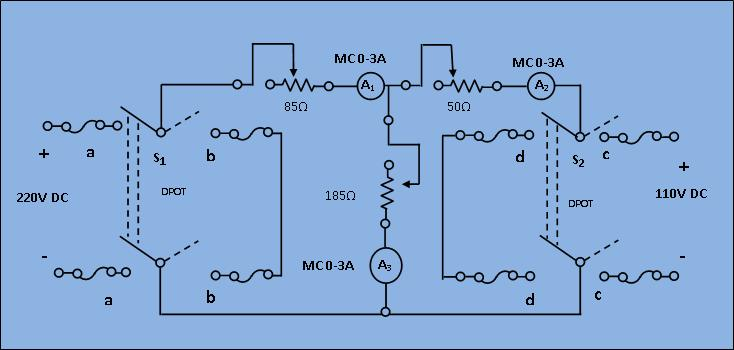

### Procedure

								<h2>Circuit Diagram:</h2>
								

								

								

								
[Fig 1: Circuit diagram of experimental set-up for verification of Tellegen's theorem]
 
								 
								

								<ol type="1">
									<li>Connect the circuit as shown in the circuit diagram above, keeping the switches open and resistance at their maximum positions. </li>
									 <li><b>Case 1: </b>In presence of both the sources 
									Select switch of S1 to Power and S2 to Power and switch on the supply to get the ammeter readings.
									Observe the power supplied in +ve and power dissipated in -ve by the elements and voltage source for this condition. </li>
									 
									<li><b>Case-2:</b> In presence of V1 only
									   Select switch of S1 to Power and S2 to short and switch on the supply. Read the corresponding power values as done in the above case. 
									  </li>
									<li><b>Case-3: </b>In presence of V2 only
									  Select switch of S1 to Short and S2 to switch on the supply.
									 Read the corresponding power values.    
									 Calculate the power consumed or delivered by each element for each case and 
									 check if power absorbed = power delivered. This  proves the Tellegen's theorem. </li>
								</ol>    
								

							

