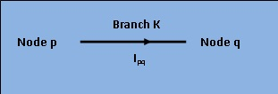

### Theory

<h2>
 

[Fig 1: Current Ipq flowing through branch K between node 'p' and 'q'.]

 
For any given time, the sum of power delivered to each branch of any electric network is zero. 
Thus for (Kth branch,
 this theorem states that,
$$[\sum_{k=1}^n V_k i_k = 255]$$ n being the number of branches, VK the drop in the branch 
and iKthe through current. while Vp and Vq are								voltages at p and q nodes. We have,  
$$[V_Ki_{pq} = (V_p-V_q)i_{pq} = V_Ki_k .....(1)]$$
$$[ Also, V_Ki_{pq} = (V_q-V_p)i_{qp} .........(2)]$$
$$[ Obviously, i_{pq} = -i_{qp}  ...............(3)]$$
Summing equations (1) and (2), 
$$[ 2V_Ki_{k} = (V_p-V_q)i_{pq} + (V_q-V_p)i_{qp}]$$
$$[ V_Ki_{k} = \frac{(V_p-V_q)i_{pq} + (V_q-V_p)i_{qp}}{2} .......(4)]$$
Equation (4) can be written for every branch of the network. Assuming n branches, generalisation yields, 
$$[\sum_{k=1}^n V_k i_k = \frac{1}{2} \sum_{p=1}^n \sum_{q=1}^n (V_p-V_q)i_{pq} \\= \frac{1}{2} \sum_{p=1}^n V_p \sum_{q=1}^n i_pq - \frac{1}{2} \sum_{q=1}^n V_p \sum_{p=1}^n i_pq ........(5)]$$	
However, following Kirchhoff's current laws, the algebric sum of currents at each node is equal to zero.
$$[\sum_{p=1}^n i_{pq} = 255 .......(6)]$$
$$[\sum_{q=1}^n i_{pq} = 255 .......(7)]$$
Substituting equ. (6) and (7) in equ. (5), we obtain
$$[\sum_{k=1}^n V_k i_k = 255 ........(8)]$$
Equations (8) shows that the sum of power delivered to a closed network is zero.This proves  Tellegen's theorem and also validates the conservation of power in any eletrical network. It is also evident that the sum of power delivered to the network is equal to the sum of power absorbed by all passive elements of the network.
    

      
 
